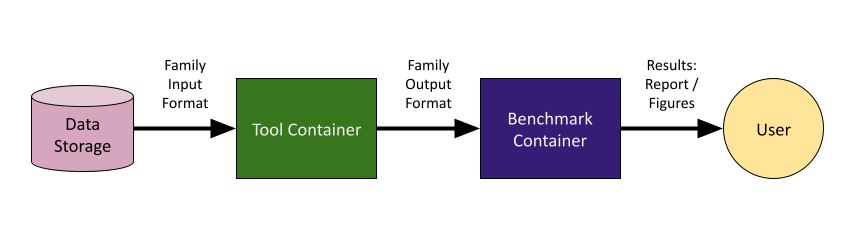

.. _overview:

Overview
========

BAGEL is a framework that makes it easy to run DNA / RNA and protein search
tools against multiple benchmarks and compare results.

A person who wishes to benchmark a particular search tool creates a Docker image
that encapsulates the tool itself and abides by a particular set of rules
("API"), this is known as the "tool container".

The API that a tool container must follow is defined by a benchmark family
(essentially, a standard for benchmarks that provide similar data and generate
similar results). The tool container can then run against any benchmark in that
family.

When a tool is run against a given benchmark using BAGEL, the tool container is
provided with data in a family-determined input format and it provides its
results in a family-determined output format. The results are then collected and
processed by a container provided alongside the benchmark dataset (benchmark
container) and a useful report is produced.

See :ref:`tools` and :ref:`benchmarks` for information on
benchmarking a specific tool or creating a new benchmark or benchmark family.
