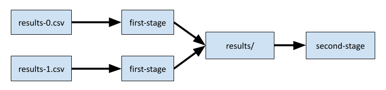

.. _stages:

Stages
======

Benchmark and tool containers can contain an arbitrary number of "stages". Think
of a stage as a single node in a computational pipeline. Each stage should
produce one or more output files, which are then passed as inputs to the next
stage.

In a benchmark or tool metadata document, BAGEL will check each stage for an
attribute called ``parallel`` (a boolean). If the value is ``true``, then each
output from the previous stage will be passed separately to parallel instances
of the stage. Otherwise, all outputs from the previous stage will be passed as a
single directory.

Example 1
---------

We will assume the list of stages given below.

.. code-block:: json

   [
       {
           "name": "first-stage",
           "parallel": true
       },
       {
           "name": "second-stage",
           "parallel": false
       }
   ]

Assuming there are two inputs, ``first-stage`` will be invoked twice, once with
each of these inputs, and these jobs will run in parallel. Once they have
finished, ``second-stage`` will be run, and will be passed a directory that
contains the outputs produced by the two ``first-stage`` jobs.

Example 2
---------

Now assume the more complicated configuration below.

.. code-block:: json

   [
       {
           "name": "first-stage",
           "parallel": false
       },
       {
           "name": "second-stage",
           "parallel": true
       },
       {
           "name": "third-stage",
           "parallel": false
       }
   ]

Now, the inputs to the first stage will be passed as a directory of files, even
if there is only one, since the first stage defined is not parallel. In other
words, the command will be invoked like this, a single time:

.. code-block:: sh

   $ first-stage /data/results/

Now the first stage can produce additional outputs by writing files to a
directory called ``results/`` and these will be parallelized automatically, with
one invocation of ``second-stage`` for each output. Each of these commands will
look something like this (the numbers will, perhaps, increment):

.. code-block:: sh

   $ second-stage /data/result-0.csv

Finally, ``third-stage`` will be run against a directory containing all of the
outputs from the parallel invocations of ``second-stage``.

.. code-block:: sh

   $ third-stage /data/results/
